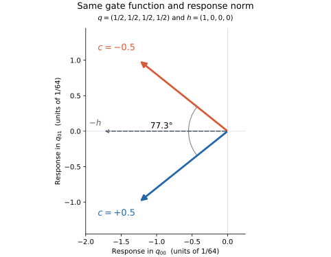

# Proposal: exact neutral exploration guided by response direction

Status: design proposal, 2026-09-12. The small algebra checks in this directory
have run; no recurrent training intervention has run. This does not change R004.
Motivation: [R003 review](../../../reviews/R003_same_function/REVIEW.md).

## Central hypothesis

Randomly move each gate within its exact same-function fiber. Favor feasible
moves that change the direction of its next task-gradient response, while keeping
a nonzero unweighted component. The hypothesis is that these local changes can
diversify subsequent functional trajectories and improve the attainable
error/description-size tradeoff.

The geometric construction and the local sensitivity formula below are
derivations. Better optimization and shorter generators are untested hypotheses.
Changing a representative does not immediately shorten the common-rounded
circuit or improve the task loss.

## 1. An exact local move

For one gate, p is a positive distribution over the 16 four-entry Boolean truth
tables. Let T have those tables as its rows, with column order 00,01,10,11.

\[
q=T^\top p,\quad A=\begin{pmatrix}\mathbf 1^\top\\T^\top\end{pmatrix},\quad
\mathcal F_q=\{p\ge0:Ap=(1,q^\top)^\top\}.
\]

A has rank five, so its kernel is eleven-dimensional. The affine constraint
makes probability coordinates convenient: any finite move p'=p+delta*d with
Ad=0 and p'>=0 preserves q exactly in real arithmetic.

For example, gate IDs 1,7,3,5 denote AND, OR, copy-a, copy-b respectively:

| Gate | Truth table | Probability change |
| --- | --- | ---: |
| AND | 0001 | +delta |
| OR | 0111 | +delta |
| copy-a | 0011 | -delta |
| copy-b | 0101 | -delta |

The total probability and every truth-table marginal are conserved. Feasibility
is exactly

\[
-\min(p_1,p_7)\le\delta\le\min(p_3,p_5).
\]

For finite logits, use a strictly interior portion of this interval. No
renormalization or clipping of q is needed. The full relaxed local rule is
unchanged for every input. Applying such moves to shared gate parameters also
preserves every recurrent rollout, with wiring, state initialization, boundaries,
and observer fixed.

The example is one face of the four-dimensional Boolean hypercube. Choose two
of the four truth-entry positions and fix the other two; apply the alternating
(+1,-1,-1,+1) move on that face. This yields 6*4=24 moves. Their span is exactly
ker(A). In the interior, these small moves access all eleven neutral tangent
directions; this is not a claim about unrestricted mixing on boundary faces.

An equivalent dense construction uses a constant orthonormal basis N of ker(A).
A particularly natural basis comprises the eleven Walsh characters of degrees
two through four. With s_gr=2*T_gr-1, its columns are
N_gS=(1/4)*product_{r in S}s_gr for |S|>=2. Thus normalization and first moments
stay fixed while higher truth-table moments can change.

A projected displacement in logit coordinates would generally preserve q only
to first order unless it were integrated or retracted accurately. These affine
probability moves provide finite-step neutrality directly.

## 2. What those directions can change

Let h_i = grad_{q_i} L(Q) be the task gradient for gate i, including all its uses
through the recurrent computation. During a neutral move of any gates, Q and
h_i stay fixed. Define c_g=t_g-q for one gate. Under Euclidean logit SGD,

\[
J_{rg}=p_g c_{gr},\qquad
M(p)=JJ^\top=\sum_g p_g^2c_gc_g^\top,\qquad
v(p)=-M(p)h.
\]

The next effective-table step is eta*v+O(eta^2). M is a positive semidefinite
mobility matrix, positive definite in the full-support interior.

Ordinary task gradients provide no force along the exact probability fiber:
grad_p L=T*h is orthogonal to ker(A). Exploration therefore requires an
additional rule. The redundant variables can change the mobility of subsequent
task updates, even though the current task computation is constant.

Correlations here concern the four outputs of a truth table drawn according to
p. They are distinct observables from correlations of cellular states during
runtime; both can be logged, with their definitions kept explicit.

## 3. Exact example isolating direction

Take

\[
p_g(c)=\frac{1+c\,s_{g0}s_{g1}}{16},\quad |c|<1.
\]

All four marginals equal 1/2 for every c. The selected spin correlation is c.
For h=(1,0,0,0), the induced response is

\[
v(c)=-\frac1{64}(1+c^2,\,2c,\,0,\,0).
\]

At c=+1/2 and c=-1/2, both distributions have full support, both implement the
same relaxed gate, and the response norms are equal. The responses are
77.3196 degrees apart. The instantaneous loss decrease is also equal for this
chosen h. Any benefit from choosing one would depend on subsequent gradients
or finite-step curvature; the example itself establishes no preferred choice.

This is a useful test fixture because a scalar learning-rate change cannot
account for the difference.

## 4. A local score for exploration

Write u=v/||v||. At fixed q and h, the derivative of v along the fiber has the
following convenient ambient extension:

\[
B_{:g}=-2p_g c_g(c_g^\top h).
\]

For a neutral direction d,

\[
D_pu[d]=\frac{(I-uu^\top)Bd}{\|v\|}.
\]

The perpendicular projection removes changes that merely scale that gate's
current response. It deliberately omits some potentially useful changes in
per-gate step sizes, so it tests directional exploration specifically.

For each of the 24 moves, compute its feasible interval [ell_k,r_k]. One
explicit bounded proposal is

\[
\delta_k=\rho X_k,\quad X_k\sim\operatorname{Uniform}[\ell_k,r_k],
\quad 0<\rho<1.
\]

Then E[delta_k^2]=rho^2*(ell_k^2+ell_k*r_k+r_k^2)/3. Score the expected squared
first-order angular displacement:

\[
s_k=E[\delta_k^2]\,
\frac{\|(I-uu^\top)Bd_k\|^2}{\|v\|^2}.
\]

This accounts for the move's feasible amplitude. The same result must also be
examined per matched realized probability displacement, since greater freedom
to move is not the same as greater directional sensitivity.

Choose a move with probability

\[
P(k)=\frac{1-\gamma}{24}
+\gamma\frac{s_k}{\sum_j s_j},\quad 0\le\gamma<1,
\]

and apply p <- p+delta_k*d_k. Gamma=0 is the uniform-choice control; gamma>0
favors moves with a larger predicted directional effect. When v=0 or all
scores vanish, use uniform choice and report the directional score as
undefined or zero as appropriate. Resolve numerical underflow explicitly
rather than inserting a small denominator that fabricates a large effect.

The feasible-interval draw can have nonzero mean at an asymmetric point of
the fiber. Even gamma=0 should therefore be described precisely as uniform
move selection with uniform interval proposals. The underrelaxed process is
not claimed to sample the fiber uniformly or obey a particular Langevin
stationary law.

Keep gamma strictly below one. For a fixed gate, the unit response has only
three tangent dimensions. Several of the eleven neutral directions can look
inactive to the immediate score while influencing higher-order effects or
responses after Q changes. Eliminating them would impose another myopic bias.

An alternative dense implementation can use N and the singular directions of
(I-uu^T)BN. The sparse version avoids per-step matrix inversions and makes
positivity handling transparent.

## 5. Alternating the two operations

A candidate iteration is:

1. Compute current Q and h by the ordinary task forward/backward pass.
2. At each selected gate, score the small neutral moves and sample one.
3. Apply the feasible probability move, encode z'=log(p') + mean(z) - mean(log(p'))
   to preserve the per-gate mean gauge, and materialize the logits as independent leaves.
4. Recompute actual p and q from those logits and check the declared neutrality
   tolerances, common rounding, and selected recurrent outputs.
5. Recompute the logit gradient g'=J(p')^T*h and take the ordinary task-SGD step.

Because Q did not change, reusing h is exact in the ideal arithmetic model.
Reusing the old logit gradient would be incorrect. The intervention is not
differentiated through as part of the ordinary task update, and the following
step retains all sixteen independent logit coordinates.

The added geometry is gate-local once h has been backpropagated. It requires
four-dimensional responses and a fixed set of sparse directions; there is no
whole-network Hessian or circuit enumeration. These operations should batch
well on a GPU, but their overhead has not been measured. The recurrence still
requires its existing backpropagation.

The first implementation should mirror R003's plain-SGD, FP64 mechanism probe.
This formula does not describe AdamW's response. An AdamW version must
differentiate the actual update with its declared moments, counters, clipping,
and decay policy. There is no automatically correct optimizer-state reset or
transport induced by moving to another representative. R004 remains unchanged.

## 6. What to test first

Use the same source checkpoints and probe semantics as R003 for a new named
diagnostic. Do not pool a new set of perturbations into the completed R003
result or silently broaden its eligibility rules.

| Arm | Purpose |
| --- | --- |
| Identity | Numerical and ordinary-update baseline |
| Uniform neutral moves, gamma=0 | Does exact neutral randomness diversify subsequent computation? |
| Direction-weighted neutral moves, gamma>0 | Does the geometric score improve functional exploration per movement budget? |

Use matched source checkpoints and random inputs. Preserve failed cases and
separate checkpoint times and decay histories. Compare equal realized
probability-displacement budgets, and separately compare following task steps
at matched global q-step norms, to distinguish direction from amplitude.
Matching step norms may require changing the probe learning rate; label that
control separately from fixed-rate behavior.

Retain output-response measurements on loss and additional inputs. A large
local q-response angle can disappear under the recurrent observer. If the
weighted rule only increases internal motion, it has not passed the proposed
functional-exploration test.

Measure before/after q, full-rule neutrality, actual finite steps, response
angles/norms, and measured versus predicted angular displacement. Include the
smaller-step audit. The feasibility fraction rho, mixing weight gamma,
frequency, gate-selection policy, tolerances, optimizer, and movement-matching
rule must be frozen before a training comparison; none are selected here.

Only after this mechanism check should a separate paired training comparison
ask about exact-solution discovery and the error/size trajectory. Fresh-start
training and checkpoint interventions answer different questions and should
have separate labels. Retain the same architecture, task loss, hardening,
description accounting, and data stream within each comparison.

## 7. Limits and useful trajectory observables

More rotation is not necessarily a better search direction. The primary
hypothesis concerns exploration; task accuracy and compact complete descriptions
remain the eventual criteria. Do not reward rotation as if it were compression.

When the full task gradient h is exactly zero, all same-function representatives
also have zero plain-SGD response. Neutral movement alone cannot restart that
deterministic process. Likewise, a Boolean-vertex q has a singleton fiber.
Stochastic data gradients, functional perturbations, or another intervention
would be needed to leave a true stationary point.

There is a useful bound near a Boolean corner. Let b_r round q_r and set
epsilon=sum_r min(q_r,1-q_r). Every representative places at least 1-epsilon
mass on table b, by the union bound. Hence any two representatives satisfy

\[
\operatorname{TV}(p,p')\le\epsilon.
\]

Feasible probability displacements therefore contract as all truth entries
approach a Boolean vertex. Relative response differences can still remain
large; this bound does not explain R003's endpoint angles by itself. A single
truth entry approaching a boundary does not imply the entire fiber vanishes.

For trajectory analysis, log:

- the eleven higher-order Walsh moments and connected versions with conventions;
- probability displacement and neutrality residuals;
- the spectrum of M and its trace-normalized shape;
- the singular spectrum of directional sensitivity on the fiber;
- temporal correlations of responses and selected neutral coordinates;
- error, common-hard circuit size, and ultimately complete encoded description length.

A one-step lookahead is a possible later exploitation rule. Evaluate the task
loss after a virtual update and bias the sign of a feasible neutral move using
its derivative. Along the exact fiber, the present Q and h are constant, so
the present task gradient can be detached while differentiating the virtual
update. That can avoid differentiating through the original recurrent backward
pass, although evaluating the virtual loss still costs another forward/backward
pass. It requires amplitude controls and is a distinct, more directed experiment.

## 8. Relation to existing work

The general strategy has substantial precedent. Zhao et al.'s
[Symmetry Teleportation for Accelerated Optimization](https://arxiv.org/abs/2205.10637)
moves along loss-invariant transformations to improve subsequent optimization.
Their follow-up,
[Improving Convergence and Generalization Using Parameter Symmetries](https://arxiv.org/abs/2305.13404),
studies further optimization and generalization effects.

Wu et al.'s
[Teleportation With Null Space Gradient Projection for Optimization Acceleration](https://arxiv.org/abs/2502.11362)
projects a secondary gradient-norm objective into layer-input null spaces. Its
practical approximations and input-dependent constraints should not be
conflated with our complete effective-truth-table equality.

The adaptation proposed here uses exact, data-independent LUT fibers and
small local exchanges, with directional exploration rather than gradient-norm
maximization as the first secondary criterion. No claim of literature novelty
or demonstrated training advantage is made.

## 9. Completed algebra checks

[Sanity script](sanity.py) and [machine-readable results](sanity_results.json)
record a small NumPy float64 calculation, separate from the JAX training stack:

- 24 moves, exact A*d=0, numerical span rank 11;
- 100 seeded positive probability examples;
- maximum q error after probability movement and logit round trip: 3.33e-16;
- maximum relative error of the analytic unit-response derivative against
  central differences: 9.52e-8;
- the equal-norm 77.3196-degree example;
- at the uniform representative with h=(1,0,0,0), twelve of twenty-four moves
  affect response direction to first order. Pure score weighting doubles the
  predicted squared angular displacement relative to uniform choice in this
  special fixture at equal displacement distribution. This checks the scoring
  algebra, not a network-learning improvement. The recommended mixture retains
  a uniform component.

The script also generates the figure. These calculations use no R002/R003
checkpoint payloads and do not alter any training result.
