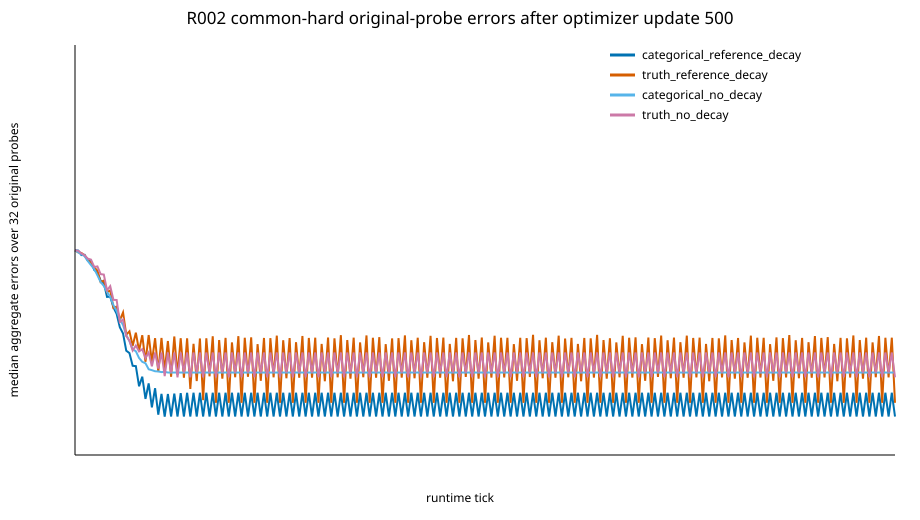
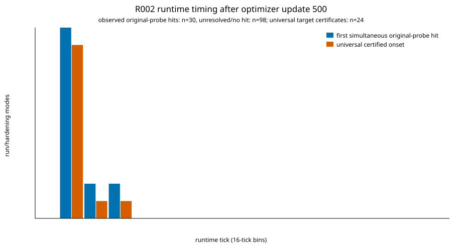
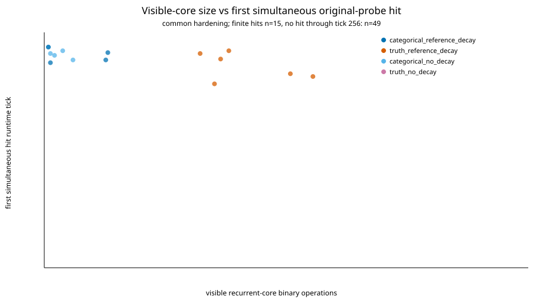

# R002 full-cohort runtime profile

Analysis ID: `R002_formal_attempt01_runtime_profile_attempt01`. Status: completed. This is a post-hoc execution of
the frozen update-500 Boolean circuits through runtime tick 256; it does not
change the original tick-20 experiment outcomes.

Across the 128 run/hardening modes, 22
original tick-20 failures are demonstrably late generators under at least one
declared later readout or a universal-state certificate. The primary common-hard
count is 11 of
60 circuits.
2 original-success
modes depend on phase or lack an initialization-independent certificate (the
primary common-hard count is 1
of 4).
0
original-success modes fail at tick 20 on at least one sampled fresh, all-zero,
or all-one initialization group.
72 modes have a certified
persistent visible failure, while 4 modes remain
unresolved by the replay and abstraction cap. The corresponding primary
common-hard counts are 36 and
2 circuits.

## Main comparison

Later counts are the number of circuits correct simultaneously on all 32
original probes at ticks 32 / 64 / 128 / 256. Mixed-cycle and unresolved counts
mean at least one of the 66 ordinary initializations for that run/hardening mode.
These flags may overlap.

| Condition | Hardening | Original success at 20 | Original all-correct at 32 / 64 / 128 / 256 | Universal eventual target | Any mixed cycle | Any unresolved orbit |
| --- | --- | ---: | ---: | ---: | ---: | ---: |
| categorical_reference_decay | common | 1 | 3 / 4 / 4 / 4 | 4 | 1 | 1 |
| categorical_reference_decay | native | 1 | 3 / 4 / 4 / 4 | 4 | 1 | 1 |
| truth_reference_decay | common | 1 | 3 / 6 / 6 / 6 | 3 | 2 | 1 |
| truth_reference_decay | native | 1 | 3 / 6 / 6 / 6 | 3 | 2 | 1 |
| categorical_no_decay | common | 2 | 5 / 5 / 5 / 5 | 5 | 0 | 1 |
| categorical_no_decay | native | 2 | 5 / 5 / 5 / 5 | 5 | 0 | 1 |
| truth_no_decay | common | 0 | 0 / 0 / 0 / 0 | 0 | 2 | 0 |
| truth_no_decay | native | 0 | 0 / 0 / 0 / 0 | 0 | 2 | 0 |

Fresh probes and all-zero/all-one initializations are retained separately in
`aggregate.json` and `runs.json`. `trajectories.jsonl.gz` contains one compact
record per run, hardening, and initialization, and `per_seed.csv` keeps the
paired design directly inspectable. Every-tick error, perfect-count, certificate,
and Hamming
arrays are stored outside git in the hashed metrics artifact named by the
manifest. Phase witnesses are likewise external artifacts.

The fixed 32 probes, fresh 32 probes, two constant states, runtime ticks, and
two hardening exports are not independent training trials. A correct suffix at
tick 256 is finite replay evidence unless a full-state cycle or universal-state
certificate establishes persistence. Circuit counts are constructive
simplifications, not minimum descriptions or Kolmogorov complexity.
