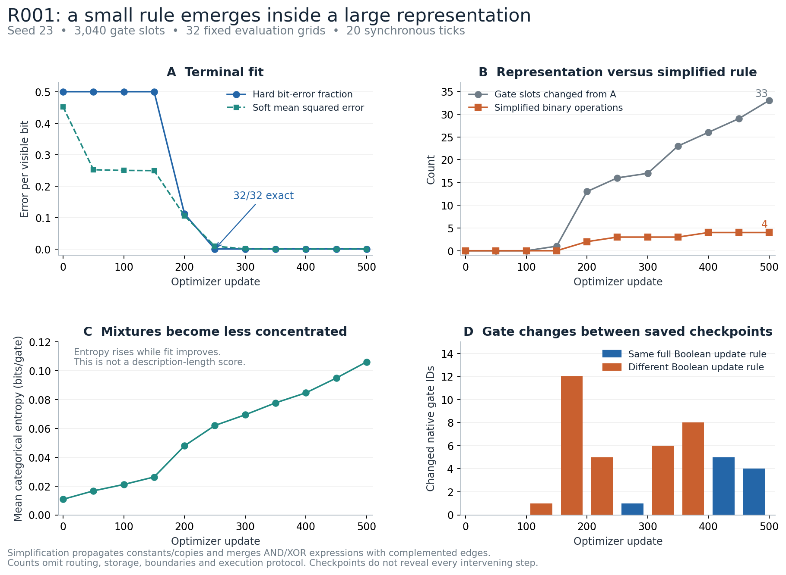
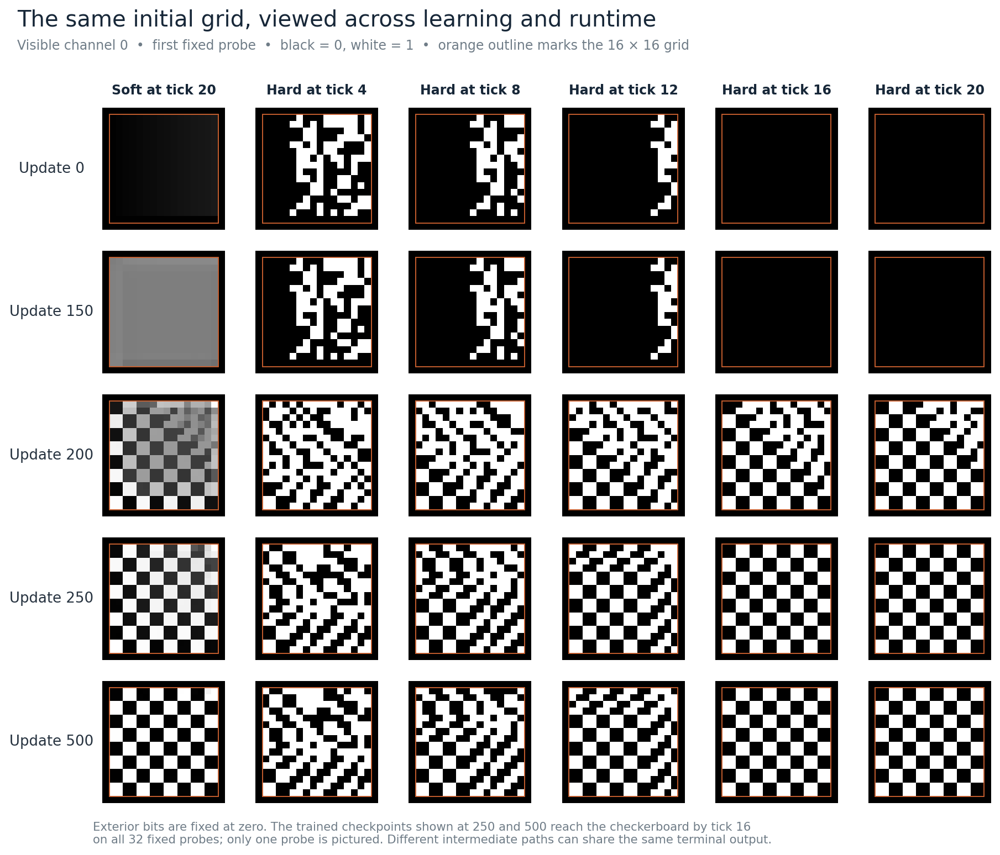

# R001 checkpoint review

Analysis date: 2026-09-10. Run:
`R001_20260909T231016Z_seed23_jaxgpu_attempt01`.
This is a post-hoc inspection of the existing run, not another training run.

The learned hard CA has a very small exact local rule. At the first perfect saved
checkpoint, update 250, its visible recurrent subsystem uses two state channels
and two binary Boolean operations per cell. The full eight-channel local rule
uses three binary operations plus routing. At update 500 those counts are three
visible-core operations and four full-rule operations. The large parameterized
network is a search representation; its raw size substantially overstates this
particular hard circuit's remaining logic.

Several saved checkpoint pairs have different gate IDs but exactly the same full
Boolean update function. Other pairs change hidden or visible transient dynamics
while preserving the terminal result. These are different equivalence relations
and should be measured separately.



## Evidence and validation

The two uploaded archives match the SHA-256 digests published in the
[`experiment/R001` release](https://github.com/trentonstrong/recurrent-circuit-learning-exps/releases/tag/experiment/R001).
All 24 constituent files match both the embedded archive manifests and the
original run manifest: eleven checkpoints, eleven selected trajectories, the
fixed evaluation set, and the final hard export.

Provenance:

- Training code: `d46a6b8c838a24b6820d4181285abbff6752231c`.
- Original result record inspected locally: `e94789f64a5a9212c3540ce49ee928ca952998e0`.
- Release metadata checked at: `f17241c5af01b74d37a9e82642a7ed10f00810c9`.
- Checkpoints archive SHA-256:
  `cff77e87faf6653ff7561c46a219ea2a3d4c1ee3af8080ba9b5c91324240bd95`.
- Analysis archive SHA-256:
  `d30d67c104729c72465eec5fa223cdf5c9eef479a440cbeca407162a7c7b739b`.

An independent NumPy implementation executes each hard gate by integer truth-table
lookup. It uses the exported wiring, exact perception flatten order, synchronous
updates, and zero exterior. No JAX, optimizer, new initial grids, or training RNG
is used in this analysis.

Validation completed:

- Full unsimplified execution exactly matches the stored 21-state hard probe
  trajectory at every one of the eleven checkpoints.
- The simplified circuits reproduce the original terminal bit-error counts and
  perfect-grid counts on all 32 fixed grids at every checkpoint.
- At update 500 the exported gate IDs match the checkpoint, and full unsimplified
  execution matches simplified execution for all 32 complete trajectories.
- All 16 Boolean functions, constants, aliased inputs, and complemented inputs
  are exhaustively checked for the local simplification algebra: 576 gate/input
  expression combinations, with their Boolean assignments.

This validates the exported hard circuit and its post-hoc interpretation. It does
not close the earlier R000 gap concerning direct execution of the vendored
notebook versus the extraction, including R001's X64-disabled sampling mode.

## What the learner found

There are 3,040 distinct gate slots, each with 16 logits. Perception parameters
are reused across eight state channels, so the unsimplified local execution has
4,608 gate instances per cell per tick. All slots initially select input A.

| Update | Hard errors / 8,192 visible bits | Gate slots differing from A | Full-rule binary operations | Visible recurrent channels | Visible-core binary operations |
| --- | ---: | ---: | ---: | --- | ---: |
| 0 | 4,096 | 0 | 0 | 0, 4, 6 | 0 |
| 100 | 4,096 | 0 | 0 | 0, 4, 6 | 0 |
| 150 | 4,096 | 1 | 0 | 0, 4, 6 | 0 |
| 200 | 916 | 13 | 2 | 0, 2 | 1 |
| 250 | 0 | 16 | 3 | 0, 2 | 2 |
| 300 | 0 | 17 | 3 | 0, 2 | 2 |
| 350 | 0 | 23 | 3 | 0, 2 | 2 |
| 400 | 0 | 26 | 4 | 0, 2, 3 | 3 |
| 450 | 0 | 29 | 4 | 0, 2, 3 | 3 |
| 500 | 0 | 33 | 4 | 0, 2, 3 | 3 |

The simplifier propagates constants and copies, uses complemented edges, and
merges identical AND/XOR expressions. The counts in this table are reachable
binary nodes in that representation. For these particular rules they also have
direct implementations with the stated number of arbitrary two-input Boolean
gates. There are no surviving XOR nodes. This is an exact simplification, not a
claim of a globally minimal circuit or a measured complete description length.

Define `NW = (y-1,x-1)`, `SW = (y+1,x-1)`, and `SE = (y+1,x+1)`;
the vertical coordinate increases downwards. Let `s_c` denote state channel `c`.
All right-hand sides use the previous tick, and **every out-of-grid read is zero**.

At update 250 the entire visible recurrent subsystem is:

```text
s0_next = s2_SW OR NOT(s2_NW OR s2_SE)
s2_next = s0_SW
```

Thus one NOR gate, one OR gate, two state bits per cell, and neighboring
reads describe its visible update mechanism. Channel 2 is a spatially shifted
one-tick copy of the visible field. The other six channels cannot influence
channel 0 at any future tick in this hard circuit.

At update 500 the visible subsystem becomes:

```text
s0_next = s2_SW OR NOT(s2_NW OR s2_SE OR s3_SW)
s2_next = s0_SW
s3_next = s0_NW
```

The full eight-channel rule also includes:

| Channel | Update 250 | Update 500 |
| --- | --- | --- |
| 1 | `s1_NW OR s1_SE` | Same |
| 3 | `s0_NW` | Same; now influences channel 0 |
| 4 | `s6_NW` | `s6_SE` |
| 5 | `s0_NW` | Same |
| 6 | `s4_SW` | Same |
| 7 | `s7_SW` | Same |

The exact original channel IDs and boundary rule matter when reproducing the
full circuit. Dropping channels outside the visible recurrent dependency closure
preserves the visible trajectory for every initial grid under the same exterior
and synchronous timing, but does not preserve all hidden outputs.

The surviving rules show that this is boundary-dependent pattern construction.
The initial all-A hard network consists entirely of reads one column to the
left, with channel routing and diagonal offsets. After 16 ticks, the zero
exterior has flushed all initial bits from a width-16 grid. Its all-zero terminal
output is therefore a property of its transport rule, rather than random
prediction failure. At update 150 the lone changed gate reroutes channel 5,
outside the visible recurrent dependency closure; the visible hard dynamics
remain exactly those of initialization.

At updates 250 and 500 the visible field reaches the target by runtime tick 16
on all 32 recorded inputs and stays correct through tick 20. This is observed
convergence on that fixed set, not a proof for all possible initial grids or all
grid sizes. No longer-runtime or new-size evaluation was added in this initial
review. The subsequent [rule walkthrough and convergence certificate](RULE250.md)
establishes convergence at tick 16 for every initial grid at checkpoint 250,
and a fixed point of its visible two-channel subsystem by tick 17, under the
same 16 by 16 zero-exterior contract.



## Three levels of hard neutrality

| Saved interval | Gate-ID changes | Full Boolean local rule | Visible trajectory on 32 probes | Terminal visible output |
| --- | ---: | --- | --- | --- |
| 250 to 300 | 1 | Identical | Identical | Identical, exact |
| 300 to 350 | 6 | Different, channel 4 only | Identical | Identical, exact |
| 350 to 400 | 8 | Different, channel 0 | 1,630 bit differences across ticks and probes | Identical, exact |
| 400 to 450 | 5 | Identical | Identical | Identical, exact |
| 450 to 500 | 4 | Identical | Identical | Identical, exact |

"Identical local rule" here is stronger than matching a finite rollout. The
symbolic expressions are identical, and exhaustive enumeration over the union
of relevant local input bits confirms equivalence. Unused bits are integrated
out exactly; the largest local comparison uses only 13 relevant bits. This is
not enumeration of whole grids or of the circuit search space.

For the 350-to-400 change, channel 0's local truth function differs on 1/16 of
uniform independent local input assignments. It therefore changes a real local
function, not merely its syntax. Yet the observed terminal result is unchanged.
The same input assignment measure is a diagnostic; it is not the distribution
of states encountered in trained recurrent rollouts.

Between updates 250 and 500 there are 18 endpoint gate-ID differences and 24
changes counted over the five saved intervals. The latter is not the full
training-time transition count: reversals between checkpoints are unobserved.
The two checkpoints differ at 80,874 state bits over all ticks/channels/probes,
including 1,630 visible bits, while their complete terminal eight-channel arrays
are identical on these 32 probes.

These observations justify distinguishing:

1. **Full hard-rule equivalence:** all eight next-state functions are identical.
2. **Visible behavioral equivalence:** changes in an unobserved subsystem do not
   propagate to the readout; this can sometimes be certified by dependency closure.
3. **Terminal-task equivalence:** the prescribed readout agrees, although earlier
   visible dynamics differ. Here this is established on the fixed evaluation set.

They do not establish that the optimizer followed a continuous neutral path
between stored checkpoints. Nor are they evidence for the specific softmax
mixture fibers proposed for R003. Effective truth entries change in all these
intervals: RMS changes are approximately 0.0122, 0.0145, 0.0205, 0.0145, and
0.0121 respectively. Exact hard neutrality can coexist with changes in the
relaxed function and its optimization objective.

## Relaxation and hardening

The long early plateau has two distinct representations. At update 100 the hard
circuit still consists entirely of A gates and terminates at zero. The selected
soft probe instead has visible terminal values from 0.4774 to 0.5355, with mean
0.5018. At update 150 the range is 0.4391 to 0.5421. The soft learner has reached
an approximately half-valued field while the discrete rule remains a transport
network. These are observed states, not evidence of a stationary optimizer.

Average categorical gate entropy rises from 0.0108 to 0.1061 bits per gate over
training. At update 250 it is 0.0620. Mean maximum gate probability falls from
0.9993 to 0.9860. Most slots remain strongly concentrated on A; a small active
subset changes substantially. A monotone entropy-sharpening narrative does not
describe this run, and gate entropy cannot be equated with a complete code length.
There is no description-cost objective in this reference experiment.

For a common representation-independent hardening diagnostic, compute
`q = softmax(z) @ T`, where `T` lists the 16 Boolean truth tables in column order
`00,01,10,11`, and round each truth entry at 0.5. Post-hoc statistics use FP64
arithmetic on the saved FP32 logits. No truth entry is exactly tied at 0.5;
the smallest threshold distance across the snapshots is about 0.000206.

Native argmax and truth-entry rounding disagree at 5 of 3,040 gate slots at
update 250 and 8 at update 500. Their full local functions differ in unobserved
channels; for example, channel 1 changes on 9/16 of uniform local assignments.
Their visible recurrent cores remain identical. Both hardening rules give the
same terminal error counts at every checkpoint, including 32/32 exact grids
from update 250 onward. This one run supplies no performance advantage for either
hardening rule, but confirms that equal task scores can conceal different circuits.

## Implications for the next experiment

The result supports retaining a generously overparameterized learner while
measuring a simplified hard rule alongside it. Here the learner discovers a
compact local mechanism without an explicit description penalty. The exact
mechanism, however, depends on the lattice, exterior, storage, and observation
schedule; the operation counts alone are not complete descriptions. A fixed codec
must charge those components and specify whether it preserves the whole state
machine or only the required observable behavior.

Keep the proposed R002 paired comparison focused on gate coordinates and weight
decay, after closing the separately recorded R000 parity gap. Useful measurement
additions are:

- Gate-ID changes and changes in effective truth tables, separately.
- Simplified hard-rule size and recurrent dependency closure of the observer.
- Whether checkpoint changes preserve the full hard function, visible dynamics,
  or only the prescribed terminal result.
- Native and truth-rounded hardening, with mismatches localized to observable
  versus unobservable subsystems.
- A histogram or layer/cone breakdown of entropy and margins, because means over
  thousands of unused hard slots can hide the gates doing the work.

For larger learned rules, exact local enumeration may become infeasible. The
linear-size simplification remains useful, but equality certification should
switch to a declared method, with sampled disagreements distinguished from proofs.
R003's same-effective-truth-table intervention remains a separate mechanism test.
No RG constants or correlators are estimated in this checkpoint review.

The initial review identified erasure of arbitrary initial conditions as the
next mechanistic question. The subsequent [walkthrough](RULE250.md) answers it
for checkpoint 250 using sound set-valued propagation. The paired representation
comparison remains a separate task.

## Reproduce this analysis

The checked execution environment was Python 3.12.14, NumPy 2.3.5, and Matplotlib
3.10.8. The scripts require only NumPy and, for figures, Matplotlib. Their separate
`uv run` environments do not modify either training environment or its lockfile.
The commands below use the dependencies tested here; no new uv lock is claimed
to have been validated for this review.

Download the two archives from the release into `release-downloads/`, then run
from the repository root:

```bash
uv run --no-project --python 3.12 --with numpy==2.3.5 \
  python reviews/R001_checkpoints/analyze_checkpoints.py \
  --bundle-dir release-downloads \
  --artifact-dir artifacts/R001_posthoc \
  --manifest results/R001_20260909T231016Z_seed23_jaxgpu_attempt01/manifest.json \
  --output-dir reviews/R001_checkpoints

uv run --no-project --python 3.12 --with numpy==2.3.5 --with matplotlib==3.10.8 \
  python reviews/R001_checkpoints/plot_checkpoints.py \
  --report reviews/R001_checkpoints/analysis.json \
  --artifact-dir artifacts/R001_posthoc \
  --output-dir reviews/R001_checkpoints
```

[Machine-readable results](analysis.json) include per-checkpoint expressions,
hardening comparisons, local equivalence counts, trajectory differences, hashes,
and validation outcomes. The report was generated using the original result
manifest at `e94789f`; using a later manifest with added release metadata changes
the recorded input-manifest hash, but not the checkpoint data or measurements.
Host/runtime metadata and analysis wall time may also differ on replay.

The PNG and SVG figures are regenerated by the plotting script. The archived
training data remains in the release; this directory contains only the review,
analysis code, compact results, and figures.
