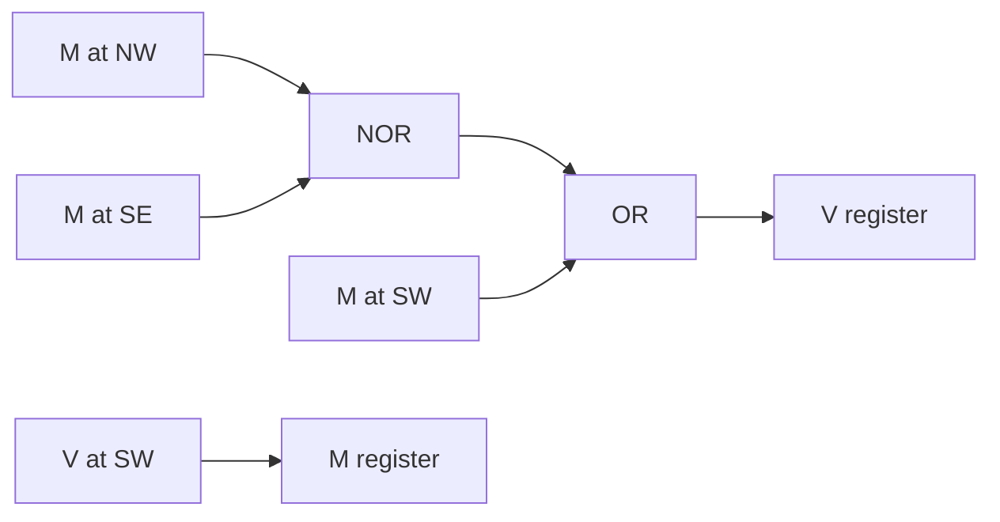

# Reading the circuit at checkpoint 250

Freeze the learned Boolean gate choices at optimizer update 250. From here,
"tick" means one synchronous update of the cellular automaton, with no learning.

The board has 16 by 16 cells. Each cell originally holds eight one-bit channels.
Only channels 0 and 2 can influence the visible output of this hard checkpoint:

| Symbol | Original channel | Role |
| --- | --- | --- |
| V | 0 | Visible bit at this location |
| M | 2 | Relay bit, loaded from a neighboring visible bit |

The visible subsystem has two bits per cell, or 512 state bits over the whole
grid. The same local rule is repeated at every cell. The six other channels
cannot influence these two fields in this hard circuit.

## One tick

NW, SW, and SE are neighbors relative to the cell being updated. Every bit read
outside the grid is zero. The rule is:

```text
V_next = M_SW OR NOT(M_NW OR M_SE)
M_next = V_SW
```

Compute both right-hand sides from the old grid, then store both new bits
simultaneously. The newly written M participates in V's computation on the next
tick. M is a delayed copy of a neighbor's V. The arbitrary initial M field
acquires this relay interpretation after the first tick.

The logic feeding one cell's two state registers is:



The NOR output is 1 exactly when both NW and SE relay bits are zero. The OR
output is 1 if the SW relay bit is 1 or if that NOR output is 1. For example,
`(M_NW, M_SE, M_SW) = (1,0,0)` produces `V_next = 0`, while `(0,0,0)`
produces `V_next = 1`.

One NOR and one OR are required per cell for this implementation. The M update
is a wire into a state register. In parallel hardware those two state registers
can be D flip-flops driven by the same clock. The gates are replicated across
grid locations; "two gates" describes the local rule.

## Why pairs appear at the bottom edge

On the bottom row, both southern neighbors are outside the grid. Their M bits
are zero, leaving:

```text
V_next(bottom, x) = NOT M(above, x-1)
```

The relay above-left is itself loaded from V on the bottom row two columns to
the left. Compose the two clock ticks:

```text
V(t+2, bottom, x) = NOT V(t, bottom, x-2)
```

This includes the fixed zero values to the left of the grid. The leftmost
bottom bit becomes 1 after the first tick; the next becomes 1 after the second.
Their opposites establish the next two positions, then another pair of ones,
and so on. The settled row is `11 00 11 00 11 00 11 00`.

This is one source of boundary information. The top-right corner is also forced
to 1 on the first tick: both of its NOR inputs lie outside the grid, so that
gate outputs 1 regardless of the SW input.

The second row from the bottom has the same two-tick relation: its southern
relays become zero because they copy visible bits from beyond the bottom edge.
The bottom two rows therefore settle to the same pattern.

## Why successive pairs of rows alternate

Away from the top-row and right-column exceptions, substituting the relay rule
gives the following relation entirely in V:

```text
V(t+2, y, x) = V(t, y+2, x-2)
              OR NOT(V(t, y, x-2) OR V(t, y+2, x))
```

Information comes from two columns left and two rows below. For a settled lower
row with pattern `1100` or `0011`, its value two columns left is the complement
of its value directly below, where both positions are in the grid. If the
directly-below bit is 0, the first OR input is already 1. If it is 1, both OR
inputs are 0. The upper row therefore becomes the complement of the lower row.
The bottom two rows agree; the next two rows have the opposite pattern; this
repeats upward.

This accounts for the two-column and two-row blocks. At the outermost edges,
use the original one-tick rule: an exterior relay is always zero and is never
updated from an interior cell. The finite verification below includes every
boundary case.

The zero exterior supplies the orientation and phase reference, while the
spatial relay and Boolean operations generate the repeated pattern. A complete
description includes the boundary convention, grid, state, and timing along
with these gate equations.

## A finite convergence certificate

During this explanation we strengthened the previous sampled convergence result
for checkpoint 250. [verify_rule250.py](verify_rule250.py) establishes:

- For every assignment of the initial V and M bits on the 16 by 16 grid, the
  visible field equals the specified checkerboard at tick 16.
- By tick 17, both V and M are fully determined and form a fixed point of this
  two-field update rule. The visible output stays correct thereafter.
- The other six channels cannot affect this result. No assertion is made that
  those six channels also reach a fixed point.

The argument uses three analysis values: known 0, known 1, and unknown `?`, which
stands for either Boolean value. Real circuit states still contain only bits.
Start every interior V and M as unknown, and exterior values as known zero.
Propagate sets through the circuit: `NOT ? = ?`, `0 OR ? = ?`, and
`1 OR ? = 1`, for example. These rules never discard a possible concrete state.
By induction, each known bit is valid for every possible initial assignment.

The counts of known visible bits at ticks 0 through 16 are:

```text
0, 2, 5, 8, 17, 22, 37, 44, 65, 74, 101, 112, 145, 158, 197, 212, 256
```

Every known bit agrees with the target. At tick 17 all 512 core bits are known;
applying the rule once more leaves them unchanged. This is a finite,
computer-checked certificate over all initial assignments, without enumerating
the 2^512 initial core states. Ignoring correlations can keep some bits unknown
longer than necessary, but cannot make a known value unsound.

The verifier checks the abstract gate tables against their concrete sets, checks
the local equations against the simplified checkpoint on all 1,024 assignments
of its relevant local inputs, and checks coordinate and clock indexing against
the recorded 21-state probe trajectory. It verifies the input artifact hashes
and uses the previously checked hard simplification.

[rule250_certificate.json](rule250_certificate.json) records the assumptions,
checks, and complete abstract trace. This is a derived property of the frozen
checkpoint on its existing grid and boundary, not a new training run, a
size-generalization claim, or a proof-assistant formalization. It does not close
the separately recorded R000 source-execution parity gap.

After extracting the release with the checkpoint analysis script, reproduce it
from the repository root:

```bash
uv run --no-project --python 3.12 --with numpy==2.3.5 \
  python reviews/R001_checkpoints/verify_rule250.py \
  --artifact-dir artifacts/R001_posthoc \
  --output reviews/R001_checkpoints/rule250_certificate.json
```
