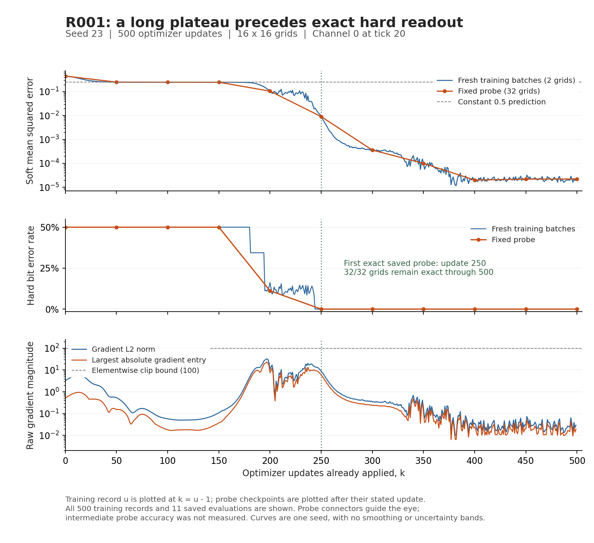

# Review of the first recurrent baseline results

Reviewed repository commit: `e94789f64a5a9212c3540ce49ee928ca952998e0`.
Canonical training code commit: `d46a6b8c838a24b6820d4181285abbff6752231c`.

**Assessment:** the committed R001 records support a working recurrent positive
control. The native-hard circuit is exact on the declared 32-grid probe at update
500. Complete the direct upstream execution comparison described below before
treating R000 as full source-equivalence evidence and launching R002.

This review inspected the notebook, extracted implementation, parity code,
manifests, and all 500 training records. Source, config, and GPU-lock SHA-256
values were checked against the committed contents. No model was retrained or
checkpoint replayed in this review; the workstation artifact paths are not
accessible from the review environment.

[Vector figure](trajectory.svg), [derived measurements](analysis.json), and
[plotting script](plot_trajectory.py). The script reads the committed run records
and needs matplotlib; it performs no model execution. Training records describe
pre-update parameters, so record u is plotted at k = u - 1. Fixed probes describe
post-update parameters. Losses are normalized by their respective visible bit
counts for the figure, while the original summed losses remain in the ledger.

## What the run establishes

| Saved update | Fixed-probe soft SSE | Hard bit errors / 8,192 | Perfect grids |
| ---: | ---: | ---: | ---: |
| 0 | 3,700.2612 | 4,096 | 0/32 |
| 150 | 2,041.1954 | 4,096 | 0/32 |
| 200 | 864.4678 | 916 | 0/32 |
| 250 | 74.4066 | 0 | 32/32 |
| 500 | 0.1816 | 0 | 32/32 |

The hard evaluation uses argmax at each gate throughout a recurrent rollout,
rather than thresholding a soft final image. The probe grids use a separate seed
and are evaluated outside the optimizer update. The run reaches the prespecified
500-update endpoint, and retains the small soft-loss increase after update 400.
These implementation choices support the reported finite-set result.

The 500 synchronized updates total 50.4346 seconds, with a 100.64 ms median.
Reported peak allocator use is 4.2595 GB, or approximately 3.97 GiB. Compile time
is reported separately. This makes the proposed seed comparison practical on
the workstation, but does not establish memory or throughput for a different
parameterization or several simultaneous processes.

One successful prescribed seed establishes a working example. The 32 probe grids
are trials of that circuit, not 32 independently trained models. This run does
not establish success rate across seeds, infinite-sequence generation, minimal
description length, or larger-grid generalization.

## What is interesting about the trajectory

1. **The early plateau eventually ends.** At updates 50–150 the soft probe loss
   is near 2,048, the loss of predicting 0.5 for all 8,192 balanced target bits.
   That is compatible with a mostly uninformative soft output, but the loss alone
   cannot establish its spatial distribution. A marked improvement follows around
   updates 150–250. At a 128-update cutoff this particular successful recipe would
   still look unsuccessful. This makes the earlier short counter pilot less
   decisive; the changed architecture prevents a causal comparison.
2. **Hard correctness precedes a close soft fit.** The hard probe is already
   exact at update 250, when the soft SSE is still 74.4066. Discretization improves
   this task's readout at that checkpoint. The same learned hard topology need not
   persist from 250 onward: exact output does not imply unchanged gate choices.
3. **Elementwise clipping is inactive in the recorded run.** The maximum raw
   gradient entry over all 500 records is 23.2527, below the bound of 100.
   Clipping therefore does not explain this run's plateau or subsequent change.
4. **Neutral movement remains a hypothesis.** Nonzero gradients and a slowly
   changing loss do not establish motion along exact neutral fibers. Checkpoint
   gate tables, hard choices, optimizer moments, and fixed-probe function changes
   can distinguish that from small but functionally significant movement.

## Close the remaining reference-validation gap

The committed `build_fixture()` in
[`r000.py`](../../recurrent_circuit_learning/r000.py) calls the extracted
`difflogic_ca.py` implementation. The GPU candidate calls the same implementation
against those CPU arrays. This is useful cross-runtime evidence. The source
checksum verifies which notebook was captured; it does not compare the captured
notebook's execution to the extraction. The committed tests contain no such
independent execution comparison.

Manual inspection found the central gate algebra, fixed wiring construction,
perception flattening, zero boundary handling, loss, and synchronous update
consistent with the source. Add a focused differential check using the actual
vendored notebook definitions in an isolated namespace, with only required
imports and the synchronous setup supplied. Compare source and extraction in
the same historical CPU environment, then retain the existing runtime check.
Cover initialized wiring and grids, one step, 20 ticks, loss, gradients, and
one optimizer step at reference and nontrivial logits. Save maximum differences
and the exact source cells used. A new 500-update training run is not needed
unless this check exposes a material mismatch.

There is also a precision-specific sampling issue to close in that check.
The recorded R000 reference and candidate enable X64, while R001 disables it.
`sample_training_batch()` leaves `jax.random.randint`'s dtype implicit. JAX
[defaults that dtype to int64 with X64 enabled and int32 otherwise](https://docs.jax.dev/en/latest/_autosummary/jax.random.randint.html).
Casting to float32 afterward does not choose the sampler's integer precision.
Consequently the current RNG equality check covers the X64-enabled fixture mode,
and does not establish seed regeneration in the actual R001 execution mode.
Run the source/extraction and cross-runtime sampling checks with X64 disabled;
keep FP64 gate probes separate. If the sampler is changed to explicit int32,
verify that the existing R001 stream is preserved, and version the revised R000
fixtures rather than overwriting the historical evidence.

## Artifact access and follow-up

**Resolved 2026-09-09:** the existing files are now published in the durable
[`experiment/R001` GitHub release](https://github.com/trentonstrong/recurrent-circuit-learning-exps/releases/tag/experiment/R001).
The run manifest records the release URL, asset sizes, and SHA-256 values. The
published checkpoint bundle, analysis bundle, and asset manifest were downloaded
from GitHub and hash-verified after publication.

The reviewed manifest identified approximately 6.8 MB of checkpoints, selected
trajectories, probe arrays, and the final gate/wire export only through absolute
workstation paths and hashes. Those paths were not retrievable through the repo
connection. The release above closes that access gap while keeping checkpoints
out of the source tree as specified, enabling inspection of the learned gadgets
and verification of readout from the exported circuit.

Then implement the already proposed R002 comparison in the working JAX stack:
16 paired seeds, four conditions, matched effective initialization and actual
wiring/data arrays, 500 updates, weight decay .01 versus zero, and both native
and common-table extraction. Keep the categorical control and truth-coordinate
learner on a common declared gate-evaluation algebra where feasible, so an
arithmetic-kernel change is visible rather than silently attributed to coordinates.
Validate soft outputs and derivatives before training and record that choice.

Use existing checkpoints around 100, 150, 200, and 250 for a parallel analysis
of the observed transition: effective q displacement, hard gate changes, input
influence, output connectivity, and optimizer moments. These are selected
post-hoc to investigate this run, not a newly unbiased evaluation set. Preserve
the original R001 trajectory and report any interventions on clones separately.

## Local Codex follow-up

> Read this review and the existing R000/R001 specs. Add the direct vendored-
> notebook versus extraction comparison, including the X64-disabled sampling
> contract used by R001. Keep FP64 gate probes separate and preserve existing
> result artifacts. Record the additional parity evidence and any discrepancy;
> rerun training only if a material mismatch requires a separately identified
> attempt. Make the existing R001 artifact bundle available through durable shared
> storage and add its checksums and location to the ledger. Report those outcomes
> before launching R002. Do not change the original seed-23 result or its budget.

Evidence: [R001 summary](../../results/R001_20260909T231016Z_seed23_jaxgpu_attempt01/summary.md),
[manifest](../../results/R001_20260909T231016Z_seed23_jaxgpu_attempt01/manifest.json),
[metrics](../../results/R001_20260909T231016Z_seed23_jaxgpu_attempt01/metrics.jsonl),
[R000 report](../../results/R000_20260909_jax_parity/parity_report.json),
and the [vendored notebook](../../references/difflogic_ca/upstream/diffLogic_CA.ipynb).
