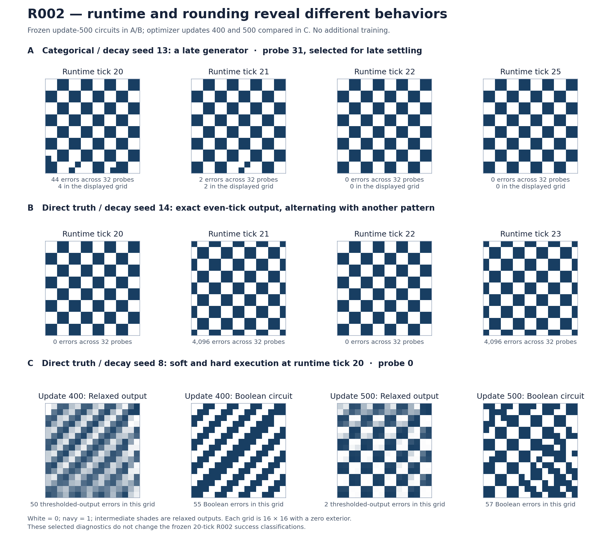

# R002: what the selected hard circuits actually compute

Review date: 2026-09-10. Source and manifests: commit
`02222f3ea6811108e2f14e9d8b4aea9562f1df06`. This is a posthoc analysis of six
selected runs from the frozen `formal_attempt01` sweep. No training was performed
and no original success classification was changed. An **update** below means an
optimizer update; a **tick** means execution of the frozen cellular automaton.

The important new finding is that a tick-20 score combines several different
behaviors. One failure is a correct generator that takes longer to settle. One
success is a two-cycle with a correct phase and an incorrect phase. Two successes
rediscover the small generator from R001, with a spatial rotation. Another
failure has a large discrepancy between its relaxed computation and its
extracted Boolean circuit.

The uploaded `R002_review_subset.tar.gz` contains 144 files, totaling 32,372,378
uncompressed bytes. Every size and SHA-256 matches the six committed run
manifests. The archive itself is 31,410,337 bytes, SHA-256
`9f86b886d37acd4886d5dd33fe1eb529802b5a6b6383940205843462e0706fba`.
The shared evaluation file was absent. A restricted NumPy implementation of the
pinned legacy JAX Threefry sampling reconstructs it byte-for-byte: 18,268 bytes,
SHA-256 `d49ecf23fd932fba25b1068f8c90820265a05fd90daadc372089520889090b2f`.
Consequently these results use the original 32 probes, not replacement samples.

All 66 saved checkpoints were decoded in both native and common hardening modes.
Independent Boolean execution matches every supplied hard trajectory and all
recorded endpoint error and perfect-grid counts. The final exported gate IDs
and wiring hashes agree with the checkpoints and manifests. FP32 and FP64
diagnostic extraction agree on every rounded gate. The soft trajectories are
read from the supplied artifacts; this review does not independently rerun JAX
soft training or its gradients.

The following table concerns common-hard circuits at optimizer update 500.
Errors are aggregated over 32 grids, each with 256 observed bits. Reference
decay is 0.01. The visible core includes every state channel that can recurrently
affect channel 0, rather than only its one-tick input cone.

| Seed and condition | Tick-20 errors | Binary operations: full / visible core | Core state bits per cell | Behavior after the specified readout |
| --- | ---: | ---: | ---: | --- |
| 4, categorical, reference decay | 0 | 5 / 2 | 2 | Visible target guaranteed from tick 16 for every initialization |
| 13, categorical, reference decay | 44 | 36 / 31 | 5 | Original probes settle by tick 22; all initializations certified by tick 25 |
| 4, categorical, no decay | 0 | 5 / 2 | 2 | Same visible core as the other seed-4 run |
| 15, categorical, no decay | 0 | 9 / 9 | 6 | Visible target guaranteed from tick 20 for every initialization |
| 8, direct truth, reference decay | 2,472 | 145 / 145 | 8 | A visible cell is provably wrong from tick 14 onward for every initialization |
| 14, direct truth, reference decay | 0 | 90 / 90 | 8 | Exact period two on the original probes: correct even phase, incorrect odd phase |

These operation counts come from exact rewriting into a shared AND/XOR graph
with complemented edges. Constants and wiring are separate. The stronger pass
flattens conjunctions, cancels complementary factors, and applies absorption.
The counts are constructive upper bounds in this representation, not proven
minimum circuits. Further temporal or algebraic reductions may exist. They also
are not complete description lengths: state allocation, wiring, boundary rule,
initialization, and observer/runtime contract must be encoded. The subset was
selected for interesting outcomes, so its circuit sizes cannot establish a
condition-wide complexity advantage.



Row A shows the late categorical generator on probe 31, selected for its latest
settling time. Row B shows the two phases of the successful direct-truth circuit
on probe 0. Row C contrasts saved soft outputs with execution of the extracted
hard circuit on probe 0. White is zero and navy is one; intermediate values occur
only in the soft images. Figure selection and counts are recorded in
`figure_metadata.json`.

Both seed-4 categorical runs simplify to the following visible subsystem. Let
`V = s0`, `M = s6`, let coordinates increase down and right, and read every state
channel as zero outside the 16 by 16 grid. Both assignments use the previous
tick's state and take effect simultaneously:

```text
V_next(y,x) = M(y-1,x+1) OR NOT(M(y-1,x-1) OR M(y+1,x+1))
M_next(y,x) = V(y-1,x+1)
```

Each cell therefore needs a NOR of its northwest and southeast memory inputs,
an OR with its northeast memory input, and a register holding the previous
northeast visible bit. Together with the visible register this is two state
bits and two binary logic operations per cell. On this grid the visible core
has 512 state bits. The zero exterior supplies the boundary information that
anchors the pattern; it is part of the generator's definition.

This is the R001 checkpoint-250 generator after a 180-degree spatial rotation
and a memory-channel rename: R001 used southwest routing and channel 2 as memory.
The current four-input equations were exhausted over all 16 relevant Boolean
assignments, and the exact input support was checked. They apply to both
seed-4 conditions from saved update 250 through 500. The complete eight-channel
local rules at update 500 differ in channels 1 and 7, which cannot affect the
visible core. This is evidence that the learner can rediscover the same small
computational structure across runs; it is not yet evidence of cross-task reuse.

For the two seed-4 circuits, conservative set-valued propagation establishes
the visible target by tick 16 and an invariant abstract state by tick 17,
starting all 2,048 interior state bits unknown. This covers every initial full
grid state; the irrelevant channels need not be specified. The same analysis
certifies the seed-15 categorical circuit's visible output from tick 20 onward,
although its hidden state can still be transient then.

The seed-13 categorical failure gives a useful separation between learning
budget and execution budget. Its frozen update-500 circuit has 44 errors at tick
20, two at tick 21, and zero from tick 22 through 64 on the original probes.
No gradient step was needed for that improvement. The all-initial-state
certificate guarantees the target by tick 25 and reaches an invariant abstract
state at tick 26. This circuit is a correct checkerboard generator under a
longer runtime contract. It remains a failure under R002's frozen 20-tick
criterion. Calling it a non-generator based solely on that score would miss
what was learned.

The seed-14 direct-truth success has a different interpretation. On all 32
probes its complete eight-channel state at tick 20 is exactly equal to its
state at tick 22. Its visible output is the target at tick 20 and has 128 wrong
bits per grid at tick 21: 4,096 aggregate errors. Determinism and equality of
the complete state prove repetition forever for these initial states. This is
an exact two-cycle, not merely an alternating error count seen for a finite
window. The odd image is neither all ones nor the full complement of the target.

There is an explicit counterexample to correctness from every initial state
at the prescribed even readout. Initialize the circuit with its own complete
tick-21 state from probe 0. That valid Boolean state repeats after two ticks and
has 128 errors after twenty ticks. The packed 2,048-bit witness, codec, and
verification facts are in `seed14_phase_counterexample.json`. Thus a universal
initial-state claim is false here, rather than merely unproved by our abstract
method. Zero and all-one initializations do pass tick 20. The original test
success is legitimate; a complete generator description must account for its
initialization and phase. A fixed observation schedule permits a periodic
computation whose visible output does not remain at the target.

The seed-8 direct-truth run illustrates the extraction problem more directly.
Its whole-probe soft summed squared error decreases from 1,186.149536 at update
400 to 157.536560 at update 500, while common-hard errors increase from 1,852 to
2,472. On the supplied first probe the comparison is:

| Optimizer update | Soft SSE on probe 0 | Errors after thresholding only the soft output | Errors from executing the extracted hard circuit |
| --- | ---: | ---: | ---: |
| 400 | 32.4551 | 50 | 55 |
| 450 | 18.6636 | 29 | 34 |
| 500 | 4.0540 | 2 | 57 |

Thresholding the final relaxed output and rounding every gate before executing
the recurrence are different operations. The former looks almost correct at
update 500; the latter does not. Additional execution time cannot simply solve
this frozen hard circuit: set-valued analysis forces the wrong visible value
at zero-based coordinate `(y=0,x=12)` from tick 14 onward for every
initialization. This is evidence about the relaxed objective and extracted
discrete dynamics. It does not identify floating-point arithmetic as the cause.

There is also exact evidence of neutrality between saved discrete snapshots.
For the seed-4 categorical/reference-decay run:

| Saved optimizer updates | Differing common gate-ID slots | Complete eight-channel local function equal? | Visible recurrent core equal? |
| --- | ---: | --- | --- |
| 250 to 300 | 145 | No | Yes |
| 300 to 350 | 42 | Yes | Yes |
| 350 to 400 | 19 | Yes | Yes |
| 400 to 450 | 20 | Yes | Yes |
| 450 to 500 | 9 | Yes | Yes |

There are 90 gate-ID differences summed over consecutive saved intervals from
300 through 500, with the entire hard local function unchanged at all those
snapshots. In the no-decay seed-4 run, the analogous total is ten over updates
350 through 500. Both visible cores remain unchanged throughout saved updates
250 through 500. These are sums of snapshot Hamming differences, not counts of
distinct gates or individual neutral mutations. We did not check intervening
optimizer steps, continuous parameter paths, or equality of relaxed functions.
Consequently this does not establish a continuous neutral path followed by the
optimizer. It does demonstrate that gate-ID motion can overstate functional
motion, even when comparing the complete hard rule.

The primary dynamical analysis uses common hardening. The final native circuit
differs only in channels 2 and 7 for categorical/reference-decay seed 4, and only
in channel 5 for categorical/reference-decay seed 13. Those channels are outside
their respective visible recurrent cores. All other selected final native and
common local rules are equal. The reported visible dynamics therefore also
apply to the final native circuits.

The verification uses an independent unsimplified 4,608-gate-instance local
evaluation to check the simplified replay on the first probe for every unique
hard checkpoint. All 32 probes are then replayed through the simplified circuit.
The stronger rewrite's 64-tick trajectories agree with the basic rewrite for
all six final circuits. The gate algebra is checked on all 16 Boolean functions
including aliased and complemented inputs, with additional composed rewrite
checks over all 256 assignments to eight test inputs. Exact comparisons of
local output functions exhaust their relevant input bits up to a cap of 16;
larger unresolved comparisons remain explicitly unknown in the JSON output.

The all-initial-state certificates use sets `{0}`, `{1}`, and `{0,1}` at each
state bit, with exact set images for individual Boolean gates. Losing
correlations can leave bits unknown but cannot falsely make a bit known.
Starting from all-unknown interior bits yields a sound overapproximation of
every concrete trajectory. Once the abstraction reaches a fixed point with
all visible bits equal to the target, every future concrete visible state is
correct. Earlier claimed onset times were checked throughout the intervening
abstract steps. Gate set-image operations were exhaustively checked on their
finite domains. These are executable finite certificates, not proof-assistant
formalizations. Their scope is the fixed 16 by 16 zero-exterior grid. No grid-size
family or unbounded-sequence generalization was tested.

The most useful next measurement is a posthoc runtime profile of the final
circuits in all 64 trials, before interpreting failures as a need for additional
optimizer updates. Keep the original tick-20 score and separately measure time
to a correct visible state, persistence or period, and initialization dependence.
This would distinguish late generators, phase-dependent generators, and circuits
with persistent wrong outputs across the complete cohort. It requires Boolean
execution of existing artifacts, not a new training recipe. Uniform training
continuation and R003's same-function interventions remain separate possible
experiments; neither was launched here.

To reproduce from the repository root, use the uploaded subset or assemble the
same payloads from the published R002 release. The scripts require NumPy; the
figure additionally requires Matplotlib. This review ran on Python 3.12.14,
NumPy 2.3.5, and Matplotlib 3.10.8 without JAX. For example, `uv run --no-project
--with numpy==2.3.5 --with matplotlib==3.10.8 python ...` can run each command in
an isolated environment without changing the training locks:

```bash
python reviews/R002_circuits/verify_archive.py /path/to/R002_review_subset.tar.gz
python reviews/R002_circuits/analyze_subset.py
python reviews/R002_circuits/refine_circuits.py
python reviews/R002_circuits/focused_dynamics.py
python reviews/R002_circuits/plot_behaviors.py
```

`artifact_verification.json` records payload provenance. `analysis.json` contains
both hardening modes for all saved checkpoints and the basic rewrite results.
`refined_analysis.json` contains the stronger final-circuit rewrite and runtime
certificates; its operation counts supersede the basic counts for the table
above. `focused_dynamics.json` contains the phase witness, neutral-snapshot
comparisons, and zero/all-one initialization probes. Machine-generated paths
identify this review workspace and need not match another checkout. The original
checkpoint payloads and reconstructed probe remain outside git.
