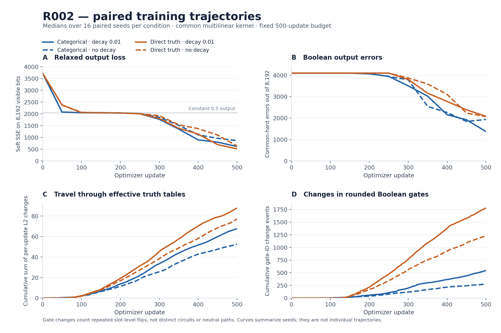

# Independent review of R002 formal_attempt01

Reviewed result commit: ba24a95dea6c7d4153843e822d9deed1fafbfed5  
Training commit: d220b65da822707cd7db3dc90df69d9250aa0f77  
Review date: 2026-09-10

The 64-run cohort is internally consistent and its published success statistics
reproduce. It does not establish a learning-success advantage for either gate
coordinate system or either decay setting. It does show a consistent difference
in the optimizer's trajectory: direct truth coordinates cause more rounded-gate
change events in every matched seed, while all 64 trials have lower fixed-probe
soft loss at update 500 than at update 400.

This review reads the committed manifests and metrics. It does not retrain the
models or independently replay the R002 checkpoint payloads.

## Integrity and what was verified

The analysis verifies the Git blob SHA-1 and byte count of all 128 input files
against the pinned result tree. It then checks:

- 64 completed trials, exactly seeds 0–15 crossed with the four declared
  conditions, each at update 500.
- All 32,000 metric records have the ordered indices 1–500; all 704 saved
  evaluations and 704 checkpoint records have the declared indices 0, 50, …, 500.
- All seeds have matching recorded wiring, categorical initialization, direct
  truth initialization, and ordered training-stream hashes across conditions.
- Code commit, config hash, GPU lock, fixed-probe identity, kernel, X64-disabled
  state, and legacy Threefry convention match the validated recipe.
- Exact-success flags, first-exact checkpoint fields, final training metrics,
  soft/hard gaps, and truth-coordinate native/common equivalence are consistent
  with their component records.
- All per-update numeric metrics and recorded soft evaluation losses are finite.
- One manifest reports a clean worktree. The other 63 list only earlier untracked
  R002 result directories and the SHA-256 of an empty tracked patch.

There are 1,536 checkpoint, trajectory, and final-circuit artifact records,
totaling 317,110,063 bytes. Their metadata are consistent, but the payloads remain
at workstation-local paths and no R002 GitHub release was present at review time.
The partner reports having verified those bytes locally. This review does not
claim an independent payload-hash check, export replay, or Boolean simplification.

## Learning outcomes

Success means zero common-hard errors on the fixed 32-grid probe at the
prespecified update-500 endpoint. This is 8,192 visible bits per evaluation,
not 32 additional independent training trials.

| Coordinates | Weight decay | Exact seeds | Successes | 95% Wilson interval | Median hard errors | Median soft SSE |
| --- | ---: | --- | ---: | --- | ---: | ---: |
| Categorical | 0.01 | 4 | 1/16 | 1.11–28.33% | 1,373 | 617.65 |
| Direct truth | 0.01 | 14 | 1/16 | 1.11–28.33% | 2,083.5 | 517.24 |
| Categorical | 0 | 4, 15 | 2/16 | 3.50–36.02% | 1,938 | 865.85 |
| Direct truth | 0 | none | 0/16 | 0–19.36% | 2,069.5 | 635.23 |

Native and common hardening agree on exact-success classification. They disagree
on nonzero final error counts in six categorical trials. Neither extraction
should silently replace the other.

The independent calculation reproduces all reported paired mean hard-error
differences and exact McNemar p-values. Independent 100,000-resample paired
bootstrap intervals again cross zero for every primary hard-error contrast.
The bootstrap here uses NumPy's documented seed and generator; the partner used
Python random, so the Monte Carlo endpoints differ slightly as expected.
Sparse successes and wide intervals do not establish equivalence.

R001's successful canonical seed 23 was a useful positive control. It was not an
estimate of the probability of success over random wiring/data seeds. R002 now
provides that first, still imprecise, estimate for its common-kernel recipe.

## The strongest new trajectory observations

### The endpoint arrives while optimization is still progressing

For every one of the 64 trials, fixed-probe soft SSE is lower at update 500 than
at 400. This is a comparison between two endpoints, not a claim of monotonically
decreasing loss at every update. Common-hard errors improve over that interval in
48 trials, worsen in 10, and are unchanged in six.

The cohort-median soft loss spends a substantial portion of the first 250
updates near 2,048, the SSE of a constant 0.5 output on this probe. Equality or
proximity of a loss to that reference does not prove that every circuit is
actually outputting the constant. The medians then fall substantially through
the endpoint.

Seed 4 is exact under both categorical conditions from saved checkpoint 250
through 500. Categorical/no-decay seed 15 and truth/decay seed 14 first become
exact at the final saved checkpoint. No run was exact at an earlier saved
checkpoint and non-exact at 500.

These observations make the finite optimization budget a plausible limitation.
They do not prove that extra updates will solve the remaining seeds, nor that
the runs cannot encounter other stationary states. In particular, the data do
not support describing all unsuccessful runs as trapped at fixed points.

### Direct truth coordinates move more, without a demonstrated yield advantage

The following are medians over the 16 seeds. The q path length is the sum of
per-update Euclidean displacements of the same 12,160 effective truth entries
in both representations. Change events count individual gate slots changing
their common-thresholded Boolean ID; a slot can contribute repeatedly.

| Coordinates | Decay | q path length | q endpoint displacement | Common gate-change events | Mean truth-bit entropy at 500 |
| --- | ---: | ---: | ---: | ---: | ---: |
| Categorical | 0.01 | 67.58 | 17.65 | 542.5 | 0.0458 bits |
| Direct truth | 0.01 | 87.75 | 28.66 | 1,778.5 | 0.1064 bits |
| Categorical | 0 | 52.67 | 13.33 | 275.5 | 0.0157 bits |
| Direct truth | 0 | 77.10 | 23.79 | 1,231.5 | 0.0651 bits |

Direct truth has more common gate-change events in **16/16 matched seeds under
each decay setting**. Its q path is longer in 14/16 seeds with decay and 15/16
without decay. This is a consistent descriptive trajectory effect, even though
the exact-solution comparison is unresolved.

The timing is also different: the first q step is smaller for direct truth in
every pair, and its first common gate-ID change occurs later in the median
(121.5 versus 97 updates). A single initial learning-rate rescaling would not,
by itself, establish equivalence of the later optimization paths.

Adding decay also increases movement: its q path is longer in 15/16 seeds within
each representation. It produces more common gate-change events in 15/16
categorical seeds and all 16 direct-truth seeds.

These facts are not evidence of neutral exploration. More gate changes can mean
new functions, repeated threshold crossings, changes in irrelevant subcircuits,
or changes compensated elsewhere. Nor is distance in the collection of local
truth tables a distance between recurrent behaviors. Establishing neutrality
requires the circuit/state comparisons or same-q intervention described in R003.

Weight decay acts on the coordinates, not on a complete circuit description.
For direct sigmoid coordinates, decay alone moves logits toward zero and hence
truth entries toward 0.5. For categorical coordinates, decay alone moves logits
toward equality and their mixture toward uniform. This makes increased ambiguity
a plausible contribution to the observations; it does not isolate the cause
under the full AdamW dynamics.

No update clipped an element: the largest recorded gradient entry was 48.4465,
below the threshold of 100. Clipping therefore cannot explain the observed
between-condition differences in this cohort.

### The relaxation and the hard circuit can disagree in both directions

Truth/decay seed 8 improves its soft SSE from 1,186.15 at update 400 to 157.54 at
500 while its common-hard errors increase from 1,852 to 2,472. That is a concrete
case where optimizing the relaxed output improves while the rounded circuit
gets worse on the same probe.

Conversely, categorical/no-decay seed 4 is already exact as a hard circuit at
checkpoint 250 even though its soft SSE is still 1,119.07. The soft SSE falls
to 0.84 by 500 while the saved hard evaluations remain exact.

Thus soft SSE is neither a certificate of exact hard behavior nor a complete
description-quality score. A lower-dimensional parameterization does not remove
the distinction between optimizing a relaxation and finding a useful discrete
generator.

## Diagnostic interpretation limits

The recorded readout-cone masks are constructed from fixed wiring and follow
both gate inputs. They do not inspect the current truth function to prune
constants or unused inputs. The report's phrase "hard readout dependency closure"
should therefore be read as a **structural, one-update wiring cone**, not the
minimal Boolean core or the full recurrent causal closure.

The entropy values in this review are gate-count-weighted Bernoulli entropies of
the effective truth entries. They are not categorical mixture entropy or encoded
description length. Gate-change counts are not distinct-circuit counts. No new
neutral paths, RG constants, reusable gadgets, or minimum circuit sizes are
established by these logs alone.

Both representations take approximately 41 synchronized seconds per 500-update
trial with this common evaluator. Removing gate parameters did not produce a
material optimizer-update speedup in this measured setup. The recorded memory
peak is a single-process high-water mark and cannot rank condition-level memory.

## Recommended next steps

First make the R002 artifacts accessible. A focused first circuit review needs
the four successful trials, plus categorical/decay seed 13 (44 final errors) and
truth/decay seed 8 (soft improvement with hard deterioration). Checkpoints,
selected trajectories, exported circuits, the fixed probe, and their identities
would support independent replay and simplification. The full 317 MB collection
also supports cohort-level studies.

There are then two distinct follow-up questions:

1. **Does the budget limit the learning-success comparison?** A separately named
   uniform continuation of all 64 trials from update 500 to a declared endpoint,
   such as 2,000, would address this. Restore parameters, AdamW moments, both RNG
   streams, and update index; retain the same recipe and probe. Keep the frozen
   R002 update-500 endpoint, and continue every seed rather than selecting
   promising ones. This is within-trial continuation, not cross-task transfer.
   It would still compare the declared recipes, not learning-rate-optimized
   representations.
2. **Do redundant categorical coordinates change subsequent functional motion?**
   Proceed with R003's same-q representative intervention on cloned checkpoints.
   That directly isolates the neutral-fiber mechanism. Start with its declared
   SGD diagnostic; an Adam extension requires an explicit optimizer-state policy.

The present evidence makes the budget check useful, but the R003 diagnostic is
the more direct test of the original neutral-direction question. Neither
follow-up was run or newly frozen by this review.

## Reproduction

Run from the repository root, using a Python environment with NumPy:

    python reviews/R002_formal_attempt01/analyze_results.py

This verifies the pinned inputs and writes analysis.json and the intermediate
plot_data.json. With Matplotlib available:

    python reviews/R002_formal_attempt01/plot_results.py

Local review versions: Python 3.12.14, NumPy 2.3.5, Matplotlib 3.10.8. No JAX
training, experiment configuration change, or dependency-lock change was made.

source_inputs.json records the reviewed source identities; analysis.json contains
per-run summaries, all paired contrasts, uncertainty methods, and explicit
artifact-access limits. Additional sign-flip diagnostics are exploratory and
uncorrected for multiple comparisons; the primary interpretation does not rely
on treating those as new confirmatory endpoints.
