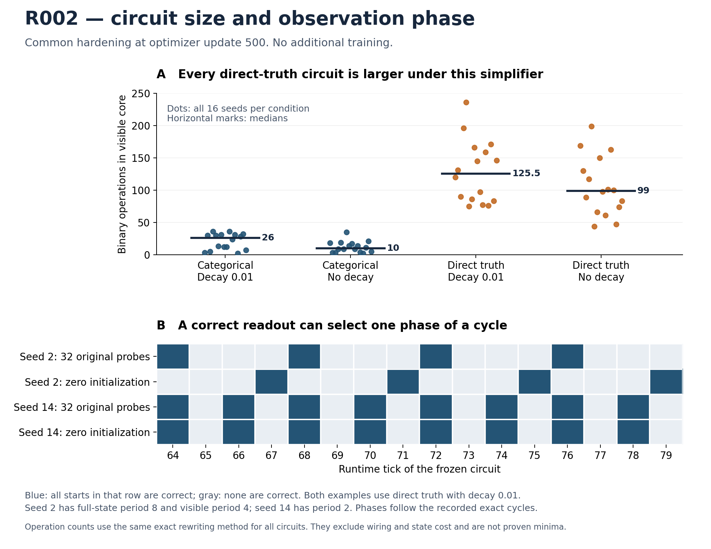

# Independent review of the full R002 runtime profile

Reviewed on 2026-09-10 against commit
`60ef04441ff16e26e395e28b9c5c63cb7d2849af`. The profile was executed from clean
implementation commit `f3fa7d04b9194f67f8b6dcd9568514210c06e113` and is recorded in
[its result directory](../../results/R002_formal_attempt01_runtime_profile_attempt01/summary.md).
This review performs no training and changes no original outcomes.

The full-cohort results strengthen the timing explanation and reveal a large
structural difference between coordinate systems. At optimizer update 500,
four of the 64 common-hard circuits pass all original probes at runtime tick
20. Fifteen pass at tick 64. The additional eleven consist of nine circuits
with universal convergence certificates, one more that reaches a correct
fixed point from every tested initialization, and one that reaches the target
on selected phases of a cycle. These are different forms of learned behavior.

All counts below use the primary common-hard extraction, one circuit for each
training run. The native extraction is checked separately; its headline counts
agree. The two extractions are not independent trials.

| Condition | Original probes correct at tick 20 | Original probes correct at tick 64 | All 66 starts correct at tick 64 | Universal eventual target certificate | All original sampled orbits eventually always correct |
| --- | ---: | ---: | ---: | ---: | ---: |
| Categorical, decay 0.01 | 1/16 | 4/16 | 4/16 | 4/16 | 4/16 |
| Direct truth, decay 0.01 | 1/16 | 6/16 | 5/16 | 3/16 | 4/16 |
| Categorical, no decay | 2/16 | 5/16 | 5/16 | 5/16 | 5/16 |
| Direct truth, no decay | 0/16 | 0/16 | 0/16 | 0/16 | 0/16 |

Here the 66 starts are the original 32 probes, the shared 32 fresh probes, and
the all-zero and all-one interior states. A universal certificate covers every
initial assignment on the fixed 16 by 16 zero-exterior grid. An exact orbit
certificate covers its explicit initial state. Passing a readout is a third,
weaker property and need not imply persistence of the visible target.

The producer's eleven-late-generator headline is numerically correct under
its declared definition: an original failure that passes all original probes
at a declared later readout or has a universal target certificate. It should
not be paraphrased as eleven new initialization-independent fixed-point
generators. The nine additional universal certificates have onset bounds of
23 through 48 ticks. The extra sampled fixed-point case is direct-truth,
reference-decay seed 0: all 66 full-state orbits reach correct fixed points,
while the universal abstraction remains inconclusive. Failure to obtain an
abstract certificate does not establish dependence on initialization.

The following disjoint accounting makes the remaining outcomes explicit. The
universal statuses take precedence, then any mixed cycle, then the remaining
sampled-orbit classifications. This is a descriptive partition, not a new
training score.

| Behavior/evidence on the primary 64 circuits | Count |
| --- | ---: |
| Every initial state certified to eventually produce and retain the target | 12 |
| All 66 sampled orbits certified eventually correct; universal test inconclusive | 1 |
| At least one sampled orbit cycles between correct and incorrect visible phases | 5 |
| A visible bit certified persistently wrong for every initial state | 36 |
| All 66 sampled orbits enter target-free cycles; universal test inconclusive | 8 |
| Some sampled orbits unresolved at 256 and universal test inconclusive | 2 |

The 36 universal failures cannot all be explained by insufficient execution
time. Their certificates identify persistent wrong visible behavior, not
merely large errors at the cap. The additional eight sampled failures have
exact eventual-orbit evidence for those starts, but no universal impossibility
claim. One of the universally failing circuits also has unresolved full-state
orbits: a wrong output can be certified without settling its hidden dynamics.

**Clock phase explains a newly discovered success.** Direct-truth,
reference-decay seed 2 has full-state period eight and visible period four on
all 66 starts. Only one quarter of its cycle phases have the desired visible
output. The 32 original probes and 32 fresh probes are all correct at ticks
64, 68, 72, and so on. The all-zero initial state instead is correct at ticks
67, 71, 75, and so on. The all-one start shares the random probes' phase.

Thus the familiar 64/128/256 readouts repeatedly sample a favorable phase for
the random probes. They do not show convergence. Moreover, after these starts
are on their cycles there is no single shared clock phase that works for all
66: the zero state is offset. A decoder can still specify a simple initial
state and the corresponding observation schedule; it must include that
contract in its description. This circuit is useful evidence about learned
timing, not a reason to retroactively change the original tick-20 result.

Seed 14 direct-truth/reference-decay retains the previously reviewed two-cycle:
half its phases are correct. All ordinary tested starts share the correct
even-tick phase, including zero and one. Its separately constructed wrong-phase
initial state still disproves correctness at tick 20 for every possible
initial state. Passing 66 ordinary probes and having a counterexample are
entirely consistent.

The other three circuits with mixed phases are categorical/reference-decay
seed 14 and direct-truth/no-decay seeds 9 and 14. Their initial states reach
different kinds of orbit. For example, direct-truth/no-decay seed 9 has 47
correct fixed-point orbits, 17 mixed-phase orbits, and two target-free orbits
among the 66 starts. These counts describe the chosen tests, not exact basin
volumes.

**The size contrast is the strongest new structural observation.** Under the
same exact FactoredDAG rewriting and recurrent visible-core definition, the
32 categorical circuits have between two and 36 binary operations. The 32
direct-truth circuits have between 44 and 236. The ranges do not overlap, and
direct truth is larger in all 16 paired seeds at each decay setting.

| Condition | Median visible-core binary operations | Observed range |
| --- | ---: | ---: |
| Categorical, decay 0.01 | 26 | 2–36 |
| Direct truth, decay 0.01 | 125.5 | 75–236 |
| Categorical, no decay | 10 | 2–35 |
| Direct truth, no decay | 99 | 44–199 |

This is a cohort-wide observation, unlike the earlier outcome-selected
six-circuit comparison. It also survives restricting attention descriptively
to the universally correct examples: the nine categorical examples use two
to 31 core operations, while the three direct-truth examples use 76, 86, and
131. That restricted comparison is selected by outcome and is not a separate
causal estimate.

The four-entry parameterization does not automatically yield a shorter
extracted generator than the sixteen-logit parameterization. Both use the same
paired wiring and discrete circuit language; the parameterization and
optimizer recipe influence which programs are reached. This supports studying
the structural bias of the search process. It does not identify its cause:
the induced gradient geometry, hardening behavior, and optimization progress
remain entangled in these trained endpoints.

The metric is still a constructive implementation count, not a proven
minimum. The common simplifier may expose some kinds of redundancy more
effectively than others, and it does not exploit every temporal invariant.
State, routing, initialization, runtime, and the observer also belong in a
complete description. A large simplified circuit could admit a much smaller
equivalent implementation under a stronger method. The exact original
success-rate inference remains unchanged; the later readouts and structural
measurements are exploratory analyses on the same sixteen paired seeds.

Small local rules can also produce complicated dynamics. One unresolved case,
categorical/no-decay seed 14, has a three-operation, one-channel visible core,
but 64 of its 66 sampled full-state trajectories have no repeat by tick 256.
This establishes neither chaos nor unbounded nonperiodicity. It does show why
local circuit size and dynamical settling cannot substitute for each other.

**Verification and limits.** The independent audit verified the exact byte
counts and SHA-256 hashes of all nine committed result files, including the
compressed trajectory records. It checked the complete 128-mode, 8,448-row
design, initial-state identities, all group tick-20 totals, report-time perfect
counts whenever the recorded orbit establishes them, cycle and suffix
consistency, all eight aggregate-table rows, the 128-row per-seed CSV, and the
original success-seed sets. The fresh probe was regenerated with the declared
PCG64 procedure and its raw-array hash matched the recorded original despite
the NumPy version difference between machines.

The six previously uploaded training runs were also replayed through runtime
tick 256 in both hardening modes: 792 logical trajectories. Their checkpoint
and export hashes match. Independent orbit extraction using NumPy unique
packed states reproduces the stored cycle entry, period, phase, canonical
cycle signature, readout error, and suffix statistics. All declared group
readout scores and the available universal certificates agree. The unsimplified
executor was checked against the simplified replay on each distinct source
rule's first probe through tick 20. These checks use the previously reviewed
Boolean executor and simplifier, rather than the new profiler's orbit-summary
function.

The other 58 runs' raw circuit payloads were not independently replayed in this
review. Their full-cohort conclusions rest on the producer's source-validation
record, the inspected implementation, and the independently checked committed
records. The external every-tick NPZ and new phase-witness NPZ files were not
downloaded here; the clock-phase figure is reconstructed from the committed
exact-orbit records. The producer records those artifacts and a 1,477,064-byte
review bundle with hashes. The profile itself reportedly took 40.68 seconds
on one CPU process, with 96 unique rules and 32 reused logical modes. This is
profiling cost, not training time or an independent benchmark on this machine.

The three committed test functions pass when invoked directly here. Pytest
is not installed in this review environment; no environment was changed. An
initial review hash check compared exported int32 gate arrays with the
profiler's canonical uint8 rule-hash convention and correctly failed. After
checking the 0–15 integer range and applying that documented normalization,
the rule hashes and replays agree. This was a review-script mismatch, not a
discrepancy in a trained circuit.

There are two reporting refinements for future reuse of the profiler. First,
`phase_or_initialization_dependent_success` currently also includes any success
without a universal certificate. Absence of proof is not positive evidence of
dependence. This does not change the present count: its sole primary member is
seed 14, which has direct phase evidence. Prefer separate flags for observed
phase dependence, an explicit initialization counterexample, and an
inconclusive universal test. Second, the per-trajectory
`certified_visible_settling_tick` currently carries only the universal bound.
A separate orbit-certified onset would represent seed 0's fixed-point result
without implying an all-initial-state certificate. The final column in this
review's first table provides that missing distinction at cohort level.

**Next decision.** Simply allowing more execution already recovers eleven
original failures under the declared late-readout definition. More training
may still help the other cases, but this profile does not predict the effect
of extending or changing the training unroll. Running a frozen hard circuit
for longer and differentiating through a longer soft rollout are different
interventions.

The recommended next mechanism study is the already proposed
[R003 neutral-fiber diagnostic](../../experiments/R003/SPEC.md). It can hold a
gate's effective truth table and present relaxed computation fixed while
changing its categorical mixture representation, then measure the induced
gradient geometry and one declared SGD step. The pronounced circuit-size
contrast supplies a concrete reason to study that mechanism. The one-step
diagnostic cannot by itself explain the entire endpoint size difference or
establish a better optimizer. A training continuation, readout-window loss,
or counter task should remain a separately named experiment. None was launched
by this review.

Reproduce the committed-record audit with
`python reviews/R002_runtime_profile/audit_results.py`. With the earlier six-run
artifact subset and reconstructed original probe available, run
`python reviews/R002_runtime_profile/replay_subset.py --artifact-root /path/to/artifacts`.
The replay expects the probe as `reconstructed_fixed_evaluation_set.npz` under
that root; the existing R002 reconstruction script produces the verified file.
Then run `python reviews/R002_runtime_profile/plot_review.py` to render the
figure. NumPy is required; plotting additionally uses Matplotlib. These review
scripts do not modify the original profile's outputs or require JAX.
