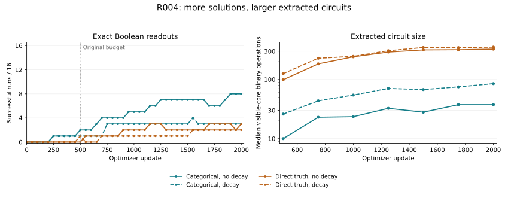

# R004 review: longer training, hardening, and description size

Reviewed 2026-09-12 from the published
[experiment/R004 release](https://github.com/trentonstrong/recurrent-circuit-learning-exps/releases/tag/experiment/R004).
This is an independent record/statistical audit and a direct replay of the fixed
seed-0 Boolean subset. GPU training and the GPU preflight were not rerun here.
The [review metrics](review_metrics.json), [recomputation script](recompute.py),
[subset replay](subset_replay.json), and [replay script](replay_subset.py) make
the scope and new calculations explicit.

## Main result

The 500-update budget was too short to judge these runs' eventual performance.
Continuing the same 64 trajectories to update 2,000 raised exact common-hard
successes from 4 to 16. Every run improved its fixed-probe soft loss. However,
longer training left a substantial gap between relaxed-output correctness and
the extracted Boolean circuit, and the extracted circuits generally grew.

| Condition | Exact at 500 | Exact at 2,000 | Median core operations at 500 | Median at 2,000 |
| --- | ---: | ---: | ---: | ---: |
| Categorical, decay | 1/16 | 3/16 | 26 | 85 |
| Direct truth, decay | 1/16 | 2/16 | 125.5 | 351.5 |
| Categorical, no decay | 2/16 | 8/16 | 10 | 37.5 |
| Direct truth, no decay | 0/16 | 3/16 | 99 | 325.5 |

Exactness retains the frozen criterion: all 32 original initial grids, visible
channel 0, runtime tick 20. Native and common extraction agree on the endpoint
success classifications. These are the same 16 paired seed groups, not 64 new
independent experiments. The circuit counts are constructive FactoredDAG
visible-core counts, not minimum circuits or complete description lengths.



Lines connect saved checkpoints; intervening success transitions are not fully
observed. The vertical line marks the old training budget. The size axis is
logarithmic and uses the same simplifier at every snapshot.

## The strongest new observation is the hardening gap

For binary targets, the summed-output-loss bound

\[
\sum_{i=1}^{8192}(y_i-b_i)^2 < \tfrac14
\quad\Longrightarrow\quad
|y_i-b_i|<\tfrac12\ \text{for every }i
\]

is sufficient to guarantee that thresholding the relaxed circuit's terminal
outputs recovers every probe bit. It is not necessary: a larger summed loss
does not by itself establish a thresholded-output error.

At update 2,000, 47/64 recorded soft losses meet this conservative criterion:
14 categorical/decay, 13 truth/decay, 8 categorical/no-decay, and 12
truth/no-decay. The largest certifying SSE is approximately 0.2145, separated
from the 0.25 threshold. Of the 48 failed common-hard circuits, 32 nevertheless
meet that sufficient soft-output criterion.

Thresholding the final relaxed outputs and replacing every gate by a Boolean
truth table are different computations. R004 provides concrete evidence that
many models fit the relaxed task while gate hardening still damages the
recurrent computation. This observation does not determine whether the damage
comes from isolated rounding decisions, accumulated recurrent sensitivity, or
essential use of continuous internal states. Distinguishing those mechanisms
requires another diagnostic.

The median fixed-probe soft SSE falls from approximately 618 to 0.00567 for
categorical/decay, 517 to 0.0109 for truth/decay, 866 to 0.158 for
categorical/no-decay, and 635 to 0.115 for truth/no-decay. Lower relaxed loss
therefore does not rank these conditions the same way as exact hard success.
All of these losses are the original summed squared-error objective, not
cross-entropy or a description-length objective.

## Circuit-size separation persists, but all four families grow

Common-hard visible-core operation counts increased in 62/64 runs between
updates 500 and 2,000. The two categorical seed-4 runs remain at two operations
by this count. This is a statement about the saved endpoints, not monotonic
growth at every intermediate update or unchanged Boolean functions at equal size.

The mean paired truth-minus-categorical size gap grows:

- With decay: 107.625 to 283.3125 operations, an increase of 175.6875; the
  specified paired-bootstrap 95% interval for the increase is [108.19, 242.38].
- Without decay: 93.625 to 285.1875 operations, an increase of 191.5625; the
  corresponding interval is [134.75, 250.94].

The gap increases for 14/16 seed pairs with decay and all 16 without decay.
At the final endpoint, truth circuits are larger in 31/32 paired comparisons.
The exception is seed 2 with decay: categorical has 362 operations and truth
329. The complete range separation seen at update 500 no longer holds.

This weakens the explanation that the original size difference merely reflected
stopping the two representations at an early training stage. It does not identify
the cause of the difference, establish asymptotic behavior, or make redundancy
in categorical coordinates its proven cause. Improved fitting and compression
remain separate observables in the current objective. Several new successful
categorical/no-decay circuits have 13–56 operations even though a two-operation
solution already exists in the same representation.

## Success is sometimes temporary, and readout timing still matters

All four runs exact at update 500 are exact at update 2,000, and 12 additional
runs become exact at the endpoint. Endpoint retention hides intervening losses:
five seed/condition histories have a saved success-to-failure transition.
Three later recover; two finish inexact. Categorical/decay seed 13 is exact at
1,550, fails again at 1,600, and ends with one wrong probe bit. Truth/no-decay
seed 14 is first exact at 1,150, fails again at 1,300, and ends with 128 wrong bits.

Categorical/no-decay is the strongest observed condition on the primary probe,
but 8/16 primary successes becomes 6/16 on all 66 declared runtime initializations
at tick 20. The two extra failures differ:

- Seed 0 passes all 32 original inputs. Direct replay here finds four wrong
  bits across the additional 32 inputs and four wrong bits from the all-zero
  start at tick 20. The zero start has two errors at tick 21 and reaches the
  target at tick 22. This is a timing miss for those inputs; the universal
  abstraction remains inconclusive.
- Seed 5's runtime records show a mixed-phase two-cycle. The original inputs
  are correct at even readouts and wrong at odd readouts; the zero start has
  the other phase and 126 errors at tick 20. This case was checked at the
  record level here, not directly replayed from its circuit payload.

These remain successes under the original fixed criterion. The broader tests
expose limitations of the learned generators rather than changing that criterion.
At update 2,000 the common-hard all-66 success counts are 3, 2, 6, and 3 in the
table's condition order. Eventual universal settling certificates cover 5, 2,
8, and 2 circuits respectively; some certified settling times exceed tick 20.
An eventual certificate is not automatically a universal tick-20 certificate.

## Statistical interpretation

The published paired endpoint tests and bootstrap results reproduce exactly
from the run/structure records and the fixed bootstrap index generator.
For the categorical-versus-truth endpoint comparison, the no-decay histories
have six categorical-only successes and one truth-only success. The two-sided
exact paired p-value is 0.125 and the prespecified Holm-adjusted value is 0.25.
With decay, the corresponding adjusted value is 1.0. The paired intervals for
the difference in hard-error improvement cross zero in both histories.

Thus 8/16 versus 3/16 is an encouraging observed difference, not an established
population advantage under this cohort and analysis. The 31 repeated evaluation
positions in R004, two hardening modes, and many probe cells do not enlarge the
independent seed sample. Decay comparisons remain descriptive in this protocol.

## Independent validation boundary

The downloaded review archive is 24,349,528 bytes, SHA-256
`209c717f8928fb22ce858c09a08fe5050411249767f172278b124e2bc72e78d2`.
Its 241 inventoried payload files passed byte-length and SHA-256 checks.
The separately downloaded release identity manifest also matched GitHub's
published digest. The fixed original probe was recovered from its hash-verified
R001 analysis release and matched its established full-file hash.

The record audit verified all 64 parent manifests against the pinned fe14ca6
repository; the unchanged protocol and GPU lock; all 96,000 per-update records;
all complete indexed batch-stream digests and the 16 four-condition pairings;
the evaluation/checkpoint/export cadences; and the final source-matching preflight
record. It reconstructed all endpoint and complete-history classifications,
the bootstrap intervals and paired tests, 896 structure records' cohort coverage,
and all 33,792 runtime-record summaries. The original-probe runtime error totals
also match the independently read run evaluation records in all 512 modes.

The direct NumPy replay covers seed 0 in all four conditions at updates 500,
1,000, 1,500, and 2,000, in both hardenings: 32 logical modes and 2,112 logical
initialization trajectories. The 24 distinct raw rules were executed for 256
ticks; all every-tick group error/perfect-input counts and universal abstraction
records matched. Direct unsimplified LUT execution for the first input through
tick 20 matched the FactoredDAG execution and every saved hard probe trajectory.
All raw gate IDs were checked for integer type and range before uint8 conversion.

The full 1,920-checkpoint payload and other seeds' circuit arrays were not
downloaded/replayed here. The run's GPU historical-resume checks and test suite
were read as recorded evidence, not independently executed. Source parameters,
Adam moments, and RNG state were not retrained or modified during this review.

## Publication and implementation follow-ups

At review time, main was `841ecf2b872832e64aac3d9e3b7be57892981540` and did not
contain the R004 implementation or result tables. The release tag points to
`fe14ca65cf62cdc3e283cf8891a745a46967bd42`; its captured dirty-source provenance
is explicit. The bundled runner and CLI hashes match every training manifest.
The final analysis source matches the final analysis/preflight provenance; the
older analysis hash recorded during training is preserved as historical metadata.
The compact summary's statement that upload was pending is stale: the release
and its assets are now published and were retrieved for this review.

The original pre-launch `R004_preflight_final/validation.json` referenced by
the cohort manifest is absent from the compact archive. The later source-matching
`R004_preflight_artifact_final` is present and passes its recorded checks. Push
the implementation and small result records, including the original preflight
and retained failed attempts, to close that reproducibility gap.

A minor loader issue remains in the bundled r004_analysis.py: load_rule casts
gate IDs to uint8 before checking their range, so invalid values could wrap or
truncate before validation. Move the integer-type/range checks before casting
when committing the implementation. All supplied seed-0 exports have valid raw
integer IDs, so this does not change the reviewed results.

## What this changes for R005

Keep R005's frozen checkpoint experiment intact. R004 supports spending effort
on representation and search geometry: more training helped, but neither hard
reliability nor small descriptions followed automatically from fitting the
relaxed objective. It does not demonstrate that neutral exploration will fix
either issue.

R005's exact neutral move preserves Q and therefore the current common-rounded
circuit. Any benefit to hardening or size must arrive through subsequent task
updates. Its controls for absolute response, directional spread, average drift,
and equal movement budgets remain necessary: a large rotation of a negligible
gradient is not a useful improvement by itself. Future training studies should
judge both the relaxed fit and the resulting complete discrete generator.

## Reproduce this review

Extract the R004 compact review archive into BUNDLE, check out the pinned fe14ca6
repository into REFERENCE, and place the hash-verified original probe at
BUNDLE/fixed_evaluation_set.npz. Then, in an environment with NumPy and Matplotlib:

```bash
python recompute.py --bundle BUNDLE --reference REFERENCE --output REVIEW
python replay_subset.py --bundle BUNDLE --reference REFERENCE --output REVIEW
python render_figure.py --review REVIEW
```

The scripts produce new review outputs. They do not alter source experiments,
consume saved training keys, or require JAX/GPU execution.
